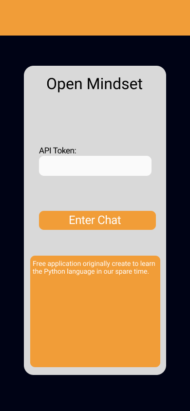

# Open Mindset iOS

## Description
This repo is the Python Kivy Project poriton of Open Mindset for iOS. It is part of the larger Open Mindset project found here: https://github.com/amwebexpert/poc-mobile-python#building-for-ios.


## Installation
To run this project, you will need to have Kivy installed. You can install Kivy with the following command:

```
git clone 
```

```
pip install -r requirements.txt
```


## Design

Here is a [Figma file](https://www.figma.com/file/RhfEYjaAIAjcj0HtC75XPH/Rough-Drafts?type=design&node-id=0%3A1&mode=design&t=vFZpgEfNsZ1XkZyg-1) where I started a section to replciate what @Andre-the-Viking started. The only thing I think he was missing was a home screen.

### Home Screen
<!--  -->

